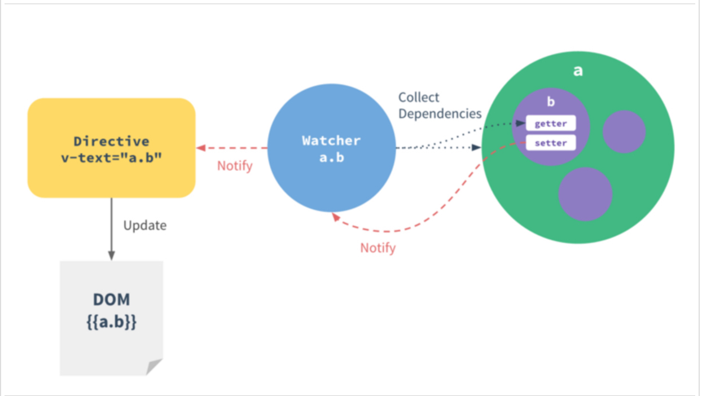

# vue-mvvm

vue的mvvm实现，通过代码实现一个超级简单的mvvm的功能，具体的代码移步git链接：

[简单的Vue-mvvm的功能,代码链接][1]
**VUE的数据的双向同步，主要通过 defineProperty把数据转化为getter与setter。**

一个简单的分工流涉及到几个对象：

图中：
 - 绿色：Observer，负责数据劫持，增加geter、seter
 - 蓝色：Warcher，订阅Observer的seter触发的钩子
 - 黄色：Compile，解析模板，分析每个节点和model上的数据关系
 - 灰色：模板、视图

大家看代码的文件顺序建议为：Observer -> Compile -> Warcher -> Vue

Observe：
-------

 1. 使用Object.defineProperty转化为getter与setter
 2. 这个文件主要完成，把一个对象的属性，在geter、seter阶段增加数据劫持，在geter节点增加事件订阅，在setter节点发布事件，触发订阅者回调

Compile：
-------
compile 是模板编辑解析，将Dom元素解析，找出指令和占位符，和Watcher建立关系，Watcher 把订阅关系注册到 Observer的监听队列里，当Observer 发布消息时，根据不同的指令，进行Dom不同的操作
**作用：**
 1. 页面初始化的时候  解析出模板（页面），把数据填充上
 2. 数据发生变化的时候，update(),把新的数据跟新到模板上

Watcher：
-------
Watcher 订阅者作为  Observer和compile的桥梁，主要做的事件是：

 1. 自身实例化的时候，往订阅器（Dep）中添加自己（这个过程是自动调用Observer的geter，并且把自己添加到对应的data.xxx的订阅器中）
 2. 自身有一个update()方法
 3. 当属性发生改变，调用Dep.notify()发布事件，Wather调用自身的update方法，并触发compile中绑定的回调

Vue
---
Vue作为数据绑定的入口，整合Observer、Compile和Watcher三者

 1. 通过Observer来监听自己的model数据变化
 2. 通过Compile来解析编译模板指令
 3. 最终利用Watcher搭起Observer和Compile之间的通信桥梁
 4. 达到数据变化 -> 视图更新；视图交互变化(input) -> 数据model变更的双向绑定效果。

[效果截图][3]

  [1]: https://github.com/shaqihe/vue-mvvm
  [2]: http://7xqd2y.com1.z0.glb.clouddn.com/vue2a.jpg
  [3]: http://7xqd2y.com1.z0.glb.clouddn.com/demo.gif
